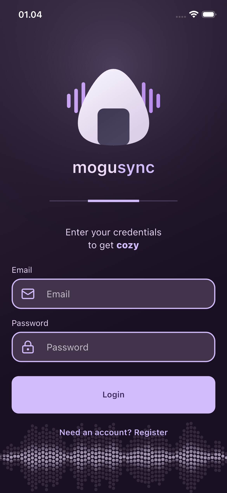
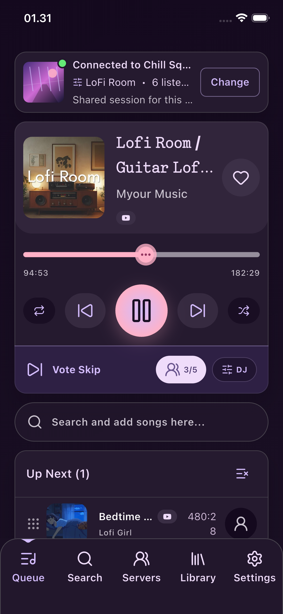
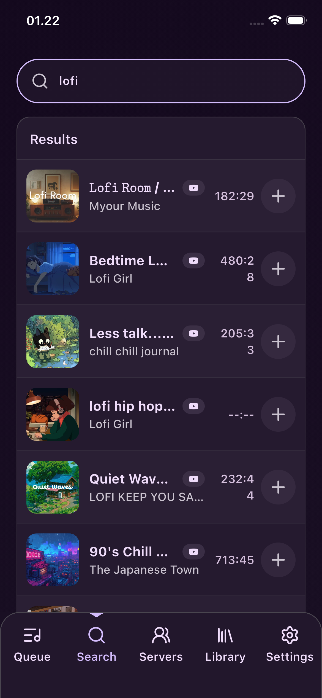
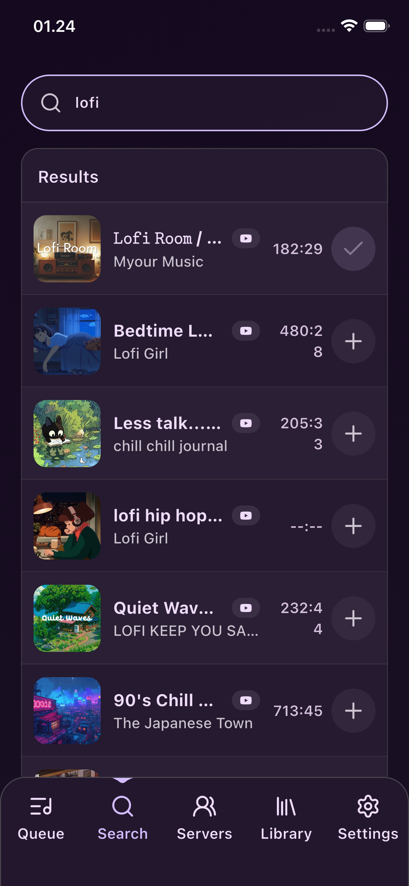

# MoguSync

<p align="center">
  
</p>

MoguSync is a Flutter mobile app for controlling a shared Discord music queue.
The app is designed as a remote controller: users authenticate, browse mock
tracks from a REST API, add tracks to a persisted queue, and view the active
music session from the Queue tab.

This repository is prepared for the Mobile Computing UAS assignment. The current
implementation focuses on the mobile app layer, state management, REST API
integration, local storage, and a clean feature-based architecture.

## Figma Design

- [MoguSync Figma Design](https://www.figma.com/design/e4oIEqujK3I73hwglQ3LkN/mogusync-Project?node-id=12-6&t=g4JWMdjwNLD2P8n5-1)

## Main Features

- Email/password login and register flow.
- REST API integration with the MoguSync backend.
- Mock track catalog loaded from the backend.
- Persisted mock queue loaded from the backend.
- Add mock tracks into the active queue.
- Queue page with active session, now playing card, vote skip UI, and upcoming queue.
- Search page with API-backed list data.
- Shared authentication and queue state with Riverpod.
- Local token storage using Shared Preferences.
- Local notification after a track is added to the queue.
- Themeable dark lavender UI based on reusable design tokens and components.

## App Navigation

```text
Login
Queue | Search | Servers | Library | Settings
```

### Queue

Displays the active session, current/first queued track, playback controls,
vote skip UI, and upcoming queue items.

### Search

Displays mock tracks from the REST API and allows authenticated users to add a
track to the queue.

### Servers

Placeholder screen for future Discord server and voice channel selection.

### Library

Placeholder screen for future server playlists, saved tracks, and recently
played tracks.

### Settings

Placeholder screen for future account and app settings.

## Architecture

The project uses a feature-based architecture with MVC-style separation of
responsibilities.

```text
lib/
  core/
    api/          Shared HTTP client, API config, API errors, token store
    components/   Reusable UI components
    navigation/   App shell and tab bar
    router/       go_router route definitions
    state/        App-wide providers
    theme/        Color, spacing, and typography tokens
  features/
    auth/         Auth controller and auth API data layer
    login/        Login screen and login widgets
    queue/        Queue screen, queue controller, queue DTOs, queue UI models
    search/       Search screen, track controller, track DTOs
    servers/      Server placeholder feature
    library/      Library placeholder feature
    settings/     Settings placeholder feature
```

The main dependency flow is:

```text
View -> Controller -> Repository -> ApiClient -> REST API
```

- **View**: Flutter pages and widgets.
- **Controller**: Riverpod `Notifier` / `AsyncNotifier` classes.
- **Repository**: Feature-owned API operations and DTO mapping.
- **ApiClient**: Shared JSON HTTP client.
- **Model/DTO**: Feature `data/` folders contain API DTOs, while feature
  `models/` folders contain app/UI-facing models.

## State Management

The app uses Riverpod.

Important providers/controllers:

- `authControllerProvider`: restores token, logs in, registers, logs out, and
  clears auth state on `401`.
- `mockTracksControllerProvider`: loads mock track catalog data from the REST API.
- `mockQueueControllerProvider`: loads persisted queue data and refreshes the
  queue after adding a track.

Riverpod is also used for dependency injection, including the HTTP client, API
base URL, API client, repositories, and token store.

## REST API Integration

The mobile app talks to the MoguSync backend through:

- `POST /api/v1/auth/register`
- `POST /api/v1/auth/login`
- `GET /api/v1/me`
- `GET /api/v1/tracks/mock`
- `GET /api/v1/sessions/mock/queue`
- `POST /api/v1/sessions/mock/queue`

The Search page satisfies the assignment requirement for a REST API-backed list
feature by loading and displaying mock tracks from `GET /api/v1/tracks/mock`.

## Local Storage

The app uses `shared_preferences` to store the temporary auth access token.

Implementation:

- Token abstraction: `lib/core/api/token_store.dart`
- Runtime initialization: `lib/main.dart`
- Auth restore/clear behavior: `lib/features/auth/auth_controller.dart`

When a protected request returns `401`, the auth controller clears the stored
token and returns the app to an unauthenticated state.

## Mobile Feature

Required by the UAS guide: implement at least one mobile device feature.

Implemented feature: **Local Notification**.

When an authenticated user adds a mock track from the Search page, the app calls
the queue API, refreshes the queue, and shows a local notification:

```text
Track added
<track title> was added to the queue.
```

## Environment Configuration

The app reads the backend base URL from `.env`:

```env
MOGUSYNC_API_BASE_URL=http://localhost:8080
```

For Android emulator testing, override with:

```sh
flutter run --dart-define=MOGUSYNC_API_BASE_URL=http://10.0.2.2:8080
```

Configuration priority:

```text
1. --dart-define=MOGUSYNC_API_BASE_URL=...
2. .env
3. http://localhost:8080
```

Do not store secrets in `.env`; Flutter assets are bundled into the app.

## Getting Started

Install dependencies:

```sh
flutter pub get
```

Run the app:

```sh
flutter run
```

Run with Android emulator API URL:

```sh
flutter run --dart-define=MOGUSYNC_API_BASE_URL=http://10.0.2.2:8080
```

Analyze the project:

```sh
flutter analyze
```

Build for web:

```sh
flutter build web
```

## Screenshots

Captured on the iPhone 16e iOS Simulator against the local API.

| Login | Queue |
| --- | --- |
|  |  |

| Search | Add to queue |
| --- | --- |
|  |  |

The final capture shows the successful add-to-queue state. The same action
also invokes the app's local notification service on supported mobile targets.

## UAS Requirement Checklist

| Requirement | Status | Evidence |
| --- | --- | --- |
| Flutter app | Done | `pubspec.yaml`, `lib/main.dart` |
| UI/UX based on UTS design | Done | Figma link and themed Flutter UI |
| Software architecture | Done | `core/`, `features/`, `data/`, `controllers/`, `widgets/` |
| State management | Done | Riverpod providers/controllers |
| REST API integration | Done | Auth, mock tracks, mock queue API |
| API-backed list feature | Done | Search page mock track list |
| Local storage | Done | Shared Preferences token storage |
| Login page | Done | Login/register flow |
| Main/home page | Done | Queue tab |
| Camera or local notification | Done | Local notification after adding a track |
| README documentation | Done | This README |
| Screenshots | Done | `docs/screenshots/` |
