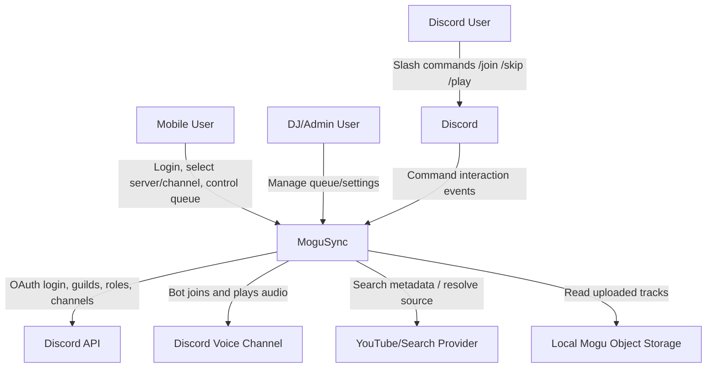

```mermaid
flowchart TD
  User[Mobile User] -->|Login, select server/channel, control queue| MoguSync[MoguSync]
  DJ[DJ/Admin User] -->|Manage queue/settings| MoguSync

  MoguSync -->|OAuth login, guilds, roles, channels| DiscordAPI[Discord API]
  MoguSync -->|Bot joins and plays audio| DiscordVoice[Discord Voice Channel]
  MoguSync -->|Search metadata / resolve source| YouTube[YouTube/Search Provider]
  MoguSync -->|Read uploaded tracks| Storage[Local Mogu Object Storage]

  DiscordUser[Discord User] -->|Slash commands /join /skip /play| Discord[Discord]
  Discord -->|Command interaction events| MoguSync
```
