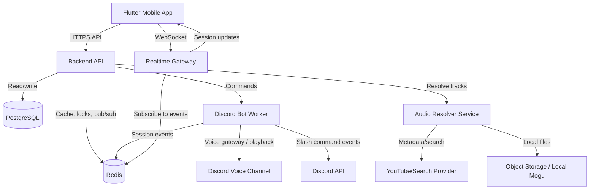

```mermaid
flowchart TD
  App[Flutter Mobile App] -->|HTTPS API| API[Backend API]
  App -->|WebSocket| RT[Realtime Gateway]

  API -->|Read/write| DB[(PostgreSQL)]
  API -->|Cache, locks, pub/sub| Redis[(Redis)]
  API -->|Commands| Bot[Discord Bot Worker]
  API -->|Resolve tracks| Audio[Audio Resolver Service]

  Bot -->|Voice gateway / playback| DiscordVoice[Discord Voice Channel]
  Bot -->|Slash command events| DiscordAPI[Discord API]
  Bot -->|Session events| Redis

  Audio -->|Metadata/search| YouTube[YouTube/Search Provider]
  Audio -->|Local files| Storage[Object Storage / Local Mogu]

  RT -->|Session updates| App
  RT -->|Subscribe to events| Redis
```
