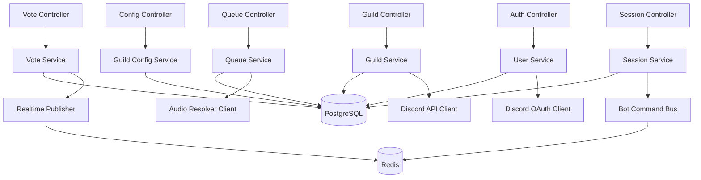

```mermaid
flowchart TD
  Auth[Auth Controller] --> UserService[User Service]
  Guild[Guild Controller] --> GuildService[Guild Service]
  Session[Session Controller] --> SessionService[Session Service]
  Queue[Queue Controller] --> QueueService[Queue Service]
  Vote[Vote Controller] --> VoteService[Vote Service]
  Config[Config Controller] --> ConfigService[Guild Config Service]

  UserService --> DiscordOAuth[Discord OAuth Client]
  GuildService --> DiscordClient[Discord API Client]
  SessionService --> BotCommandBus[Bot Command Bus]
  QueueService --> AudioResolver[Audio Resolver Client]
  VoteService --> RealtimePublisher[Realtime Publisher]

  UserService --> DB[(PostgreSQL)]
  GuildService --> DB
  SessionService --> DB
  QueueService --> DB
  VoteService --> DB
  ConfigService --> DB

  BotCommandBus --> Redis[(Redis)]
  RealtimePublisher --> Redis
```
