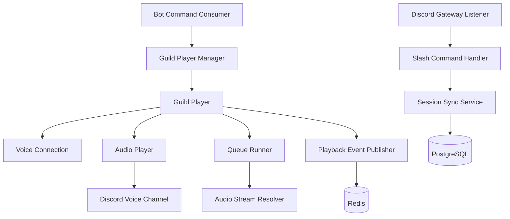

```mermaid
flowchart TD
  Gateway[Discord Gateway Listener] --> Slash[Slash Command Handler]
  Slash --> SessionSync[Session Sync Service]

  CommandConsumer[Bot Command Consumer] --> PlayerManager[Guild Player Manager]
  PlayerManager --> GuildPlayer[Guild Player]
  GuildPlayer --> VoiceConnection[Voice Connection]
  GuildPlayer --> AudioPlayer[Audio Player]
  GuildPlayer --> QueueRunner[Queue Runner]

  QueueRunner --> AudioStream[Audio Stream Resolver]
  AudioPlayer --> DiscordVoice[Discord Voice Channel]

  GuildPlayer --> EventPublisher[Playback Event Publisher]
  EventPublisher --> Redis[(Redis)]
  SessionSync --> DB[(PostgreSQL)]
```
