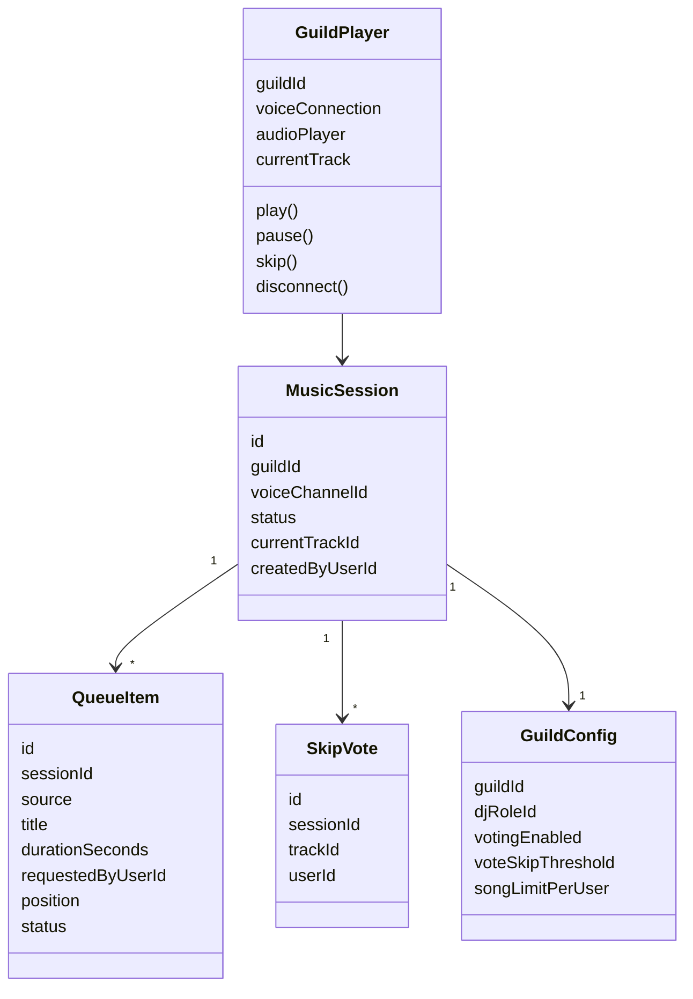

```mermaid
classDiagram
  class MusicSession {
    id
    guildId
    voiceChannelId
    status
    currentTrackId
    createdByUserId
  }

  class QueueItem {
    id
    sessionId
    source
    title
    durationSeconds
    requestedByUserId
    position
    status
  }

  class SkipVote {
    id
    sessionId
    trackId
    userId
  }

  class GuildConfig {
    guildId
    djRoleId
    votingEnabled
    voteSkipThreshold
    songLimitPerUser
  }

  class GuildPlayer {
    guildId
    voiceConnection
    audioPlayer
    currentTrack
    play()
    pause()
    skip()
    disconnect()
  }

  MusicSession "1" --> "*" QueueItem
  MusicSession "1" --> "*" SkipVote
  MusicSession "1" --> "1" GuildConfig
  GuildPlayer --> MusicSession
```
