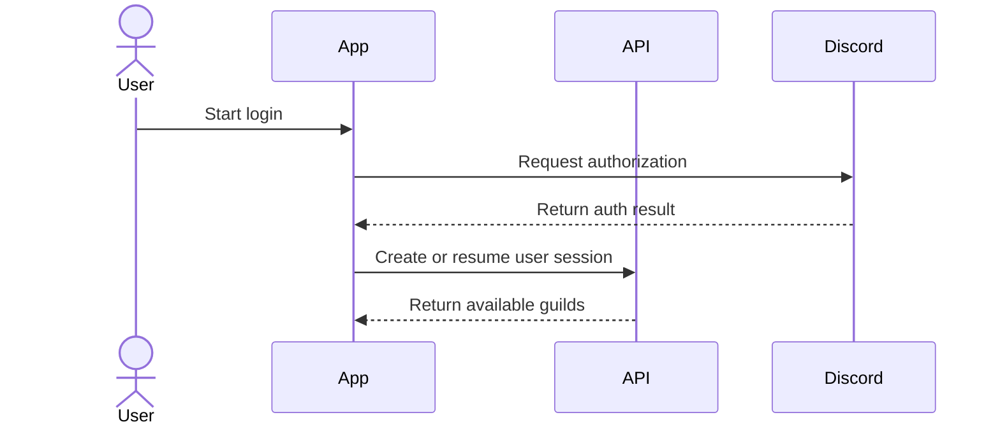

# Dynamic 01: Login And Server Setup

## Purpose

TODO: Show the flow for user login, Discord authorization, guild selection, and initial server/session setup.

## Diagram

```mermaid
sequenceDiagram
  actor User
  participant App
  participant API
  participant Discord

  User->>App: Start login
  App->>Discord: Request authorization
  Discord-->>App: Return auth result
  App->>API: Create or resume user session
  API-->>App: Return available guilds
```
