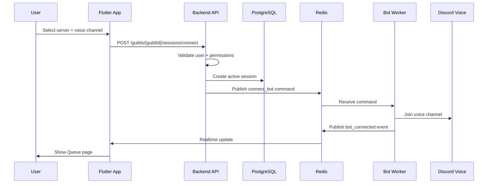

```mermaid
sequenceDiagram
  participant User
  participant App as Flutter App
  participant API as Backend API
  participant DB as PostgreSQL
  participant Redis
  participant Bot as Bot Worker
  participant Discord as Discord Voice

  User->>App: Select server + voice channel
  App->>API: POST /guilds/{guildId}/sessions/connect
  API->>API: Validate user + permissions
  API->>DB: Create active session
  API->>Redis: Publish connect_bot command
  Redis->>Bot: Receive command
  Bot->>Discord: Join voice channel
  Bot->>Redis: Publish bot_connected event
  Redis->>App: Realtime update
  App->>User: Show Queue page
```
