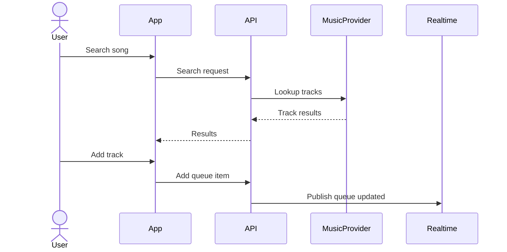

# Dynamic 03: Add Song To Queue

## Purpose

TODO: Show how a user searches for a song and adds it to the shared queue.

## Diagram

```mermaid
sequenceDiagram
  actor User
  participant App
  participant API
  participant MusicProvider
  participant Realtime

  User->>App: Search song
  App->>API: Search request
  API->>MusicProvider: Lookup tracks
  MusicProvider-->>API: Track results
  API-->>App: Results
  User->>App: Add track
  App->>API: Add queue item
  API->>Realtime: Publish queue updated
```
