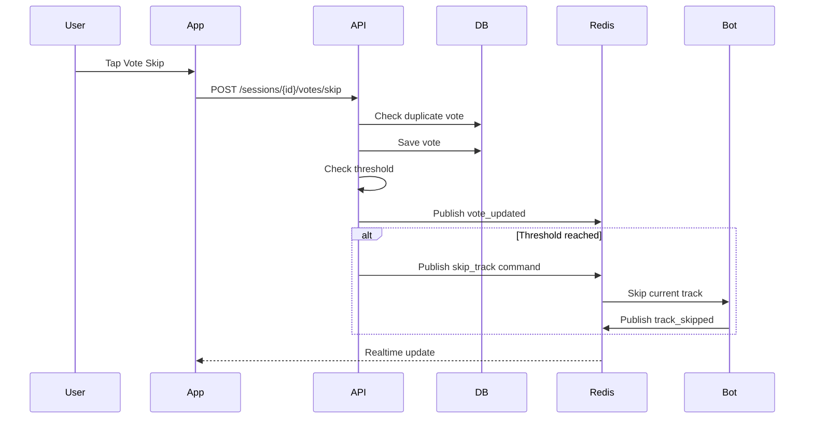

```mermaid
sequenceDiagram
  participant User
  participant App
  participant API
  participant DB
  participant Redis
  participant Bot

  User->>App: Tap Vote Skip
  App->>API: POST /sessions/{id}/votes/skip
  API->>DB: Check duplicate vote
  API->>DB: Save vote
  API->>API: Check threshold
  API->>Redis: Publish vote_updated

  alt Threshold reached
    API->>Redis: Publish skip_track command
    Redis->>Bot: Skip current track
    Bot->>Redis: Publish track_skipped
  end

  Redis-->>App: Realtime update
```
